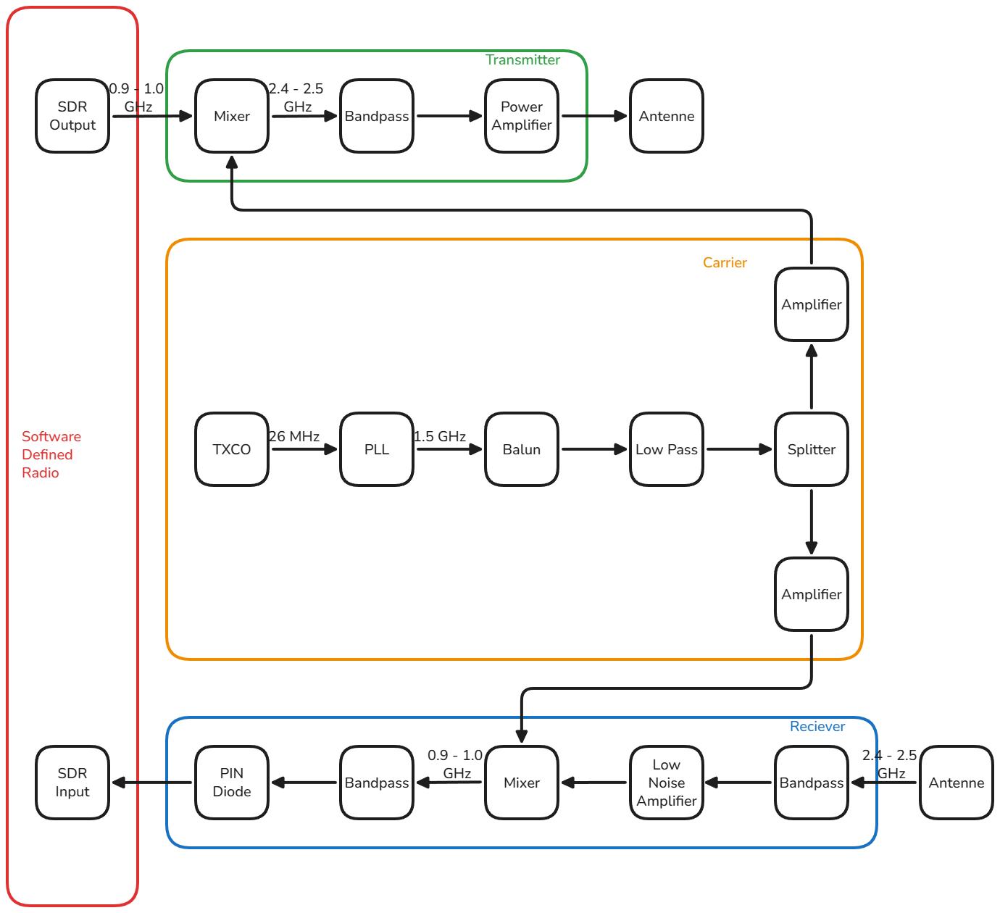

# Analog Fronted Design Documentation

## Goal
Transmit and recieve a Signal from an SDR. Convert the Frequency range of the signal from 0.9 to 1 GHz to 2.4 to 2.5 GHz and vice versa. The signal is amplified and filtered to reduce noise and interference.

So the bandwidth is 100 MHz.

## Requirements

We aim for a SNR of 80 dB on the receiver. The input signal strength for that is ???.

Production cost should not exceed 500€ in total.

the rfsoc adc input should be protected from high power signals, so the input power should not exceed 14.6 dBm.

the power supply should not interfere with the signal.

the amplification for tx and rx should be adjustable.

## Implementation

Because changing the input/output power of the signals with a discrete DIP switch is not practical, power adjustment is not implemented.

Please check out the following documents for a complete design overview:
- [Schematic Documentation](Schematic.md)
- [Layout Documentation](Layout.md)
- [Simulation Documentation](../simulation/README.md)
- [Issues](../docs/ISSUES.md)
- [Schematic PDF](../../pcb/documents/schematic.pdf)
- Block Diagram:

 

### transmitter
The RFSoC dac outputs a signal with max 40.5 mA current, output power -18.5 to 6.5 dBm.

### receiver
the adc has maximum input power 14.6 dBm, input bandwidth 6 GHz and attenuation range 27 dB.